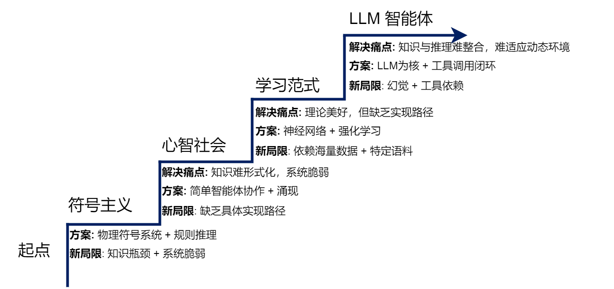

# hello-agents读书笔记

## 第一部分 智能体与语言模型基础

### 第一章 初始智能体
 大概介绍了一下传统视角下的智能体是这样的,分为
- 基于反射的智能体
- 基于目标的智能体
- 基于效用的智能体
- 基于学习的智能体
  
  接着介绍一下大语言模型驱动的新范式,和传统视角的智能体区别,智能体分类的三个维度
- 基于内部决策架构的分类
- 基于时间与反应性的分类
- 基于知识表示的分类
  
  接着介绍一下智能体的构成与运行原理,最后让我们实现一个智能体,并介绍了智能体的协作模式
### 第二章 智能体发展史
  

1. 基于符号与逻辑的早期智能体(符号主义)
典型理论成果: 专家系统
- 知识库(规则)
- 推理机(根据用户事实在知识库中应用相应规则)

典型实践应用: SHRDLU(搭建积木的智能体),ELIZA聊天机器人(基于预设规则的聊天机器人)
局限性: 
- (1)常识知识与知识获取瓶颈

符号主义智能体的“智能”完全依赖于其知识库的质量和完备性。然而，如何构建一个能够支撑真实世界交互的知识库，被证明是一项极其艰巨的任务，主要体现在两个方面：

- 知识获取瓶颈（Knowledge Acquisition Bottleneck）：专家系统的知识需要由人类专家和知识工程师通过繁琐的访谈、提炼和编码过程来构建。这个过程成本高昂、耗时漫长，且难以规模化。更重要的是，人类专家的许多知识是内隐的、直觉性的，很难被清晰地表达为“IF-THEN”规则。试图将整个世界的知识都进行手工符号化，被认为是一项几乎不可能完成的任务。

- 常识问题（Common-sense Problem）：人类行为依赖于庞大的常识背景（例如，“水是湿的”、“绳子可以拉不能推”），但符号系统除非被明确编码，否则对此一无所知。为广阔、模糊的常识建立完备的知识库至今仍是重大挑战，Cyc项目历经数十年努力，其成果和应用仍然非常有限。

- （2）框架问题与系统脆弱性

除了知识层面的挑战，符号主义在处理动态变化的世界时也遇到了逻辑上的困境。

- 框架问题（Frame Problem）：在一个动态世界中，智能体执行一个动作后，如何高效判断哪些事物未发生改变是一个逻辑难题[5]。为每个动作显式地声明所有不变的状态，在计算上是不可行的，而人类却能毫不费力地忽略不相关的变化。
- 系统脆弱性（Brittleness）：符号系统完全依赖预设规则，导致其行为非常“脆弱”。一旦遇到规则之外的任何微小变化或新情况，系统便可能完全失灵，无法像人类一样灵活变通。SHRDLU的成功，也正是因为它运行在一个规则完备的封闭世界里，而真实世界充满了例外。

2. 马文·明斯基的心智社会(符号主义的分布式智能理论)

  20世纪70至80年代，符号主义的局限性日益明显。专家系统虽然在高度垂直的领域取得了成功，但它们无法拥有儿童般的常识；SHRDLU虽然能在一个封闭的积木世界中表现出色，但它无法理解这个世界之外的任何事情；ELIZA虽然能模仿对话，但它对对话内容本身一无所知。这些系统都遵循着一种自上而下（Top-down）的设计思路：一个全知全能的中央处理器，根据一套统一的逻辑规则来处理信息和做出决策。面对这种普遍的失败，明斯基开始提出一系列根本性的问题：

- “理解”是什么？ 当我们说我们理解一个故事时，这是一种单一的能力吗？还是说，它其实是视觉化能力、逻辑推理能力、情感共鸣能力、社会关系常识等数十种不同心智过程协同工作的结果？
- “常识”是什么？ 常识是一个包含了数百万条逻辑规则的庞大知识库吗（如Cyc项目的尝试）？还是说，它是一种分布式的、由无数具体经验和简单规则片段交织而成的网络？
- 智能体应该如何构建？ 我们是否应该继续追求一个完美的、统一的逻辑系统，还是应该承认，智能本身就是“不完美”的、由许多功能各异、甚至会彼此冲突的简单部分组成的大杂烩？
这些问题直指单一整体智能模型的核心弊端。该类模型试图用一种统一的表示和推理机制来解决所有问题，但这与我们观察到的自然智能（尤其是人类智能）的运作方式相去甚远。明斯基认为，强行将多样化的心智活动塞进一个僵化的逻辑框架中，正是导致早期人工智能研究停滞不前的根源。

正是基于这样的反思，明斯基提出了一个颠覆性的构想，他不再将心智视为一个**金字塔**式的层级结构，而是将其看作一个**扁平化的、充满了互动与协作的“社会”。**

3. 从符号主义到联结主义(解决感知问题)

  作为对符号主义局限性的直接回应，联结主义（Connectionism）在20世纪80年代重新兴起。与符号主义自上而下、依赖明确逻辑规则的设计哲学不同，联结主义是一种自下而上的方法，其灵感来源于对生物大脑神经网络结构的模仿。它的核心思想可以概括为以下几点：

- 知识的分布式表示：知识并非以明确的符号或规则形式存储在某个知识库中，而是以连接权重的形式，分布式地存储在大量简单的处理单元（即人工神经元）的连接之间。整个网络的连接模式本身就构成了知识。
- 简单的处理单元：每个神经元只执行非常简单的计算，如接收来自其他神经元的加权输入，通过一个激活函数进行处理，然后将结果输出给下一个神经元。
- 通过学习调整权重：系统的智能并非来自于设计者预先编写的复杂程序，而是来自于“学习”过程。系统通过接触大量样本，根据某种学习算法（如反向传播算法）自动、迭代地调整神经元之间的连接权重，从而使得整个网络的输出逐渐接近期望的目标。

4. 基于强化学习的智能体

  联结主义主要解决了感知问题（例如，“这张图片里有什么？”），但智能体更核心的任务是进行决策（例如，“在这种情况下，我应该做什么？”）。强化学习（Reinforcement Learning, RL）正是专注于解决序贯决策问题的学习范式。它并非直接从标注好的静态数据集中学习，而是通过智能体与环境的直接交互，在“试错”中学习如何最大化其长期收益。

  以AlphaGo为例，其核心的自我对弈学习过程便是强化学习的经典体现[9]。在这个过程中，AlphaGo（智能体）通过观察棋盘的当前布局（环境状态），决定下一步棋的落子位置（行动）。一局棋结束后，根据胜负结果，它会收到一个明确的信号：赢了就是正向奖励，输了则是负向奖励。通过数百万次这样的自我对弈，AlphaGo不断调整其内部策略，逐渐学会了在何种棋局下选择何种行动，最有可能导向最终的胜利。这个过程完全是自主的，不依赖于人类棋谱的直接指导。

这种通过与环境互动、根据反馈信号来优化自身行为的学习机制，就是强化学习的核心框架。下面我们将详细拆解其基本构成要素和工作模式。

强化学习的框架可以用几个核心要素来描述：

- 智能体（Agent）：学习者和决策者。在AlphaGo的例子中，就是其决策程序。
- 环境（Environment）：智能体外部的一切，是智能体与之交互的对象。对AlphaGo而言，就是围棋的规则和对手。
- 状态（State, S）：对环境在某一时刻的特定描述，是智能体做出决策的依据。例如，棋盘上所有棋子的当前位置。
- 行动（Action, A）：智能体根据当前状态所能采取的操作。例如，在棋盘的某个合法位置上落下一子。
- 奖励（Reward, R）：环境在智能体执行一个行动后，反馈给智能体的一个标量信号，用于评价该行动在特定状态下的好坏。例如，在一局棋结束后，胜利获得+1的奖励，失败获得-1的奖励。

5. 基于大规模数据的预训练的大语言模型

  强化学习赋予了智能体从交互中学习决策策略的能力，但这通常需要海量的、针对特定任务的交互数据，导致智能体在学习之初缺乏先验知识，需要从零开始构建对任务的理解。无论是符号主义试图手动编码的常识，还是人类在决策时所依赖的背景知识，在RL智能体中都是缺失的。如何让智能体在开始学习具体任务前，就先具备对世界的广泛理解？这一问题的解决方案，最终在自然语言处理（Natural Language Processing, NLP）领域中浮现，其核心便是基于大规模数据的预训练（Pre-training）。

  通过在数万亿级别的文本上进行预训练，大型语言模型的神经网络权重实际上已经构建了一个关于世界知识的、高度压缩的隐式模型。它以一种全新的方式，解决了符号主义时代最棘手的“知识获取瓶颈”问题。更令人惊讶的是，当模型的规模（参数量、数据量、计算量）跨越某个阈值后，它们开始展现出未被直接训练的、预料之外的涌现能力（Emergent Abilities），例如：

上下文学习（In-context Learning）：无需调整模型权重，仅在输入中提供几个示例（Few-shot）甚至零个示例（Zero-shot），模型就能理解并完成新的任务。
思维链（Chain-of-Thought）推理：通过引导模型在回答复杂问题前，先输出一步步的推理过程，可以显著提升其在逻辑、算术和常识推理任务上的准确性。
这些能力的出现，标志着LLM不再仅仅是一个语言模型，它已经演变成了一个兼具海量知识库和通用推理引擎双重角色的组件。

至此，智能体发展的历史长河中，几大关键的技术拼图已经悉数登场：符号主义提供了逻辑推理的框架，联结主义和强化学习提供了学习与决策的能力，而大型语言模型则提供了前所未有的、通过预训练获得的世界知识和通用推理能力。